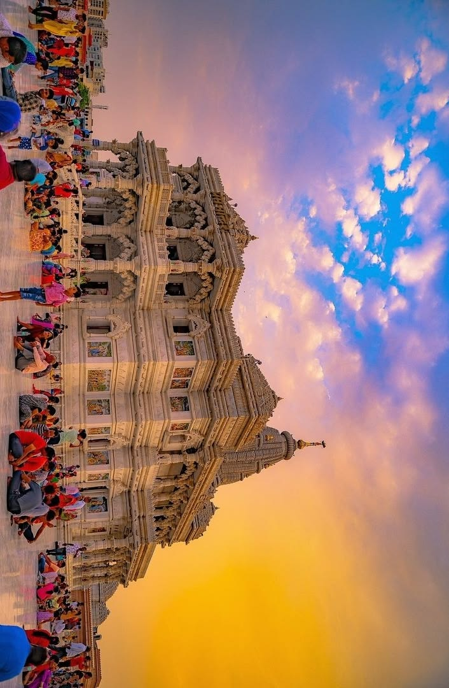
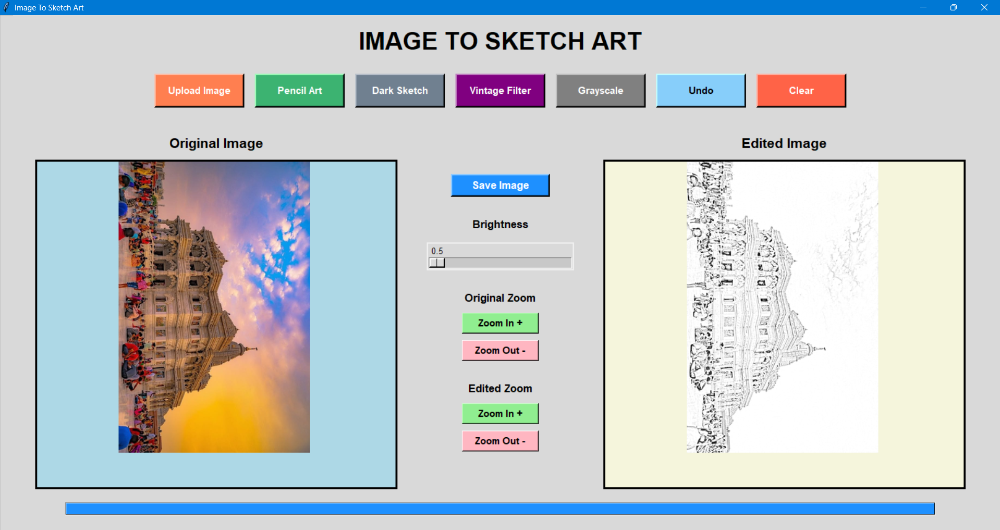
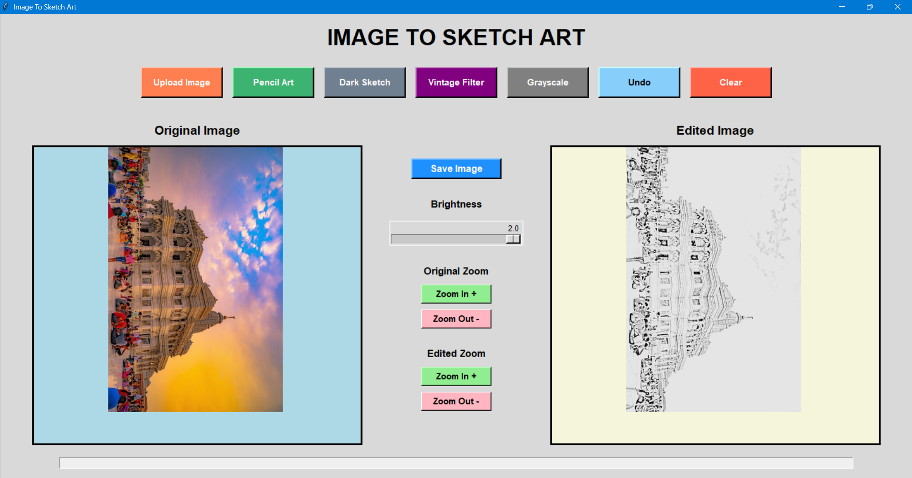
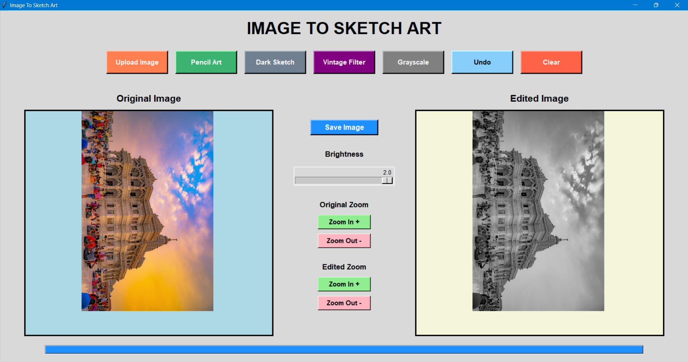
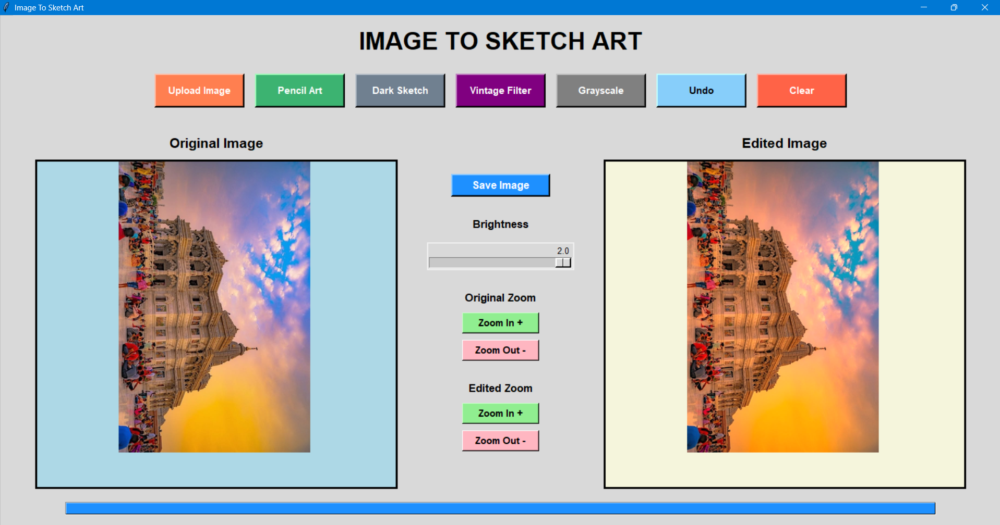

# Image to Sketch Art

A Python Tkinter application that converts images into artistic sketch effects using OpenCV and Pillow.

## Features

- Upload Image
- Pencil Art
- Dark Sketch
- Vintage Filter
- Grayscale
- Brightness Adjustment
- Undo
- Zoom In / Zoom Out
- Save Image
- Progress Bar Animation

## Technologies Used

- Python
- Tkinter
- OpenCV
- Pillow
- NumPy

## Installation

pip install -r requirements.txt

## Run

python sketch_art.py
=======
# 🎨 Image To Sketch Art

<div align="center">

# IMAGE TO SKETCH ART

### Transform Normal Images into Artistic Sketch Effects using Python, OpenCV, and Tkinter



</div>

---

# 📌 Project Overview

**Image To Sketch Art** is a Python desktop application that converts normal images into artistic sketch effects using OpenCV and Pillow.

The application provides an interactive graphical interface where users can:
- upload images
- apply artistic filters
- adjust brightness
- zoom images
- drag images
- preview processed outputs
- save edited images

This project demonstrates practical implementation of:
- Python GUI development
- OpenCV image processing
- Event-driven programming
- Image enhancement techniques

---

# ✨ Main Features

## 🖼️ Upload Image

- Upload JPG, JPEG, PNG, and BMP images
- Automatically fits image inside canvas
- Real-time image preview

---

# ✏️ Pencil Art Filter

Converts images into smooth pencil sketch style.

## Preview

| Original | Pencil Art |
|---|---|
|  |  |

---

# 🌑 Dark Sketch Filter

Creates dramatic dark pencil-art style effects with enhanced contrast.

## Preview

| Original | Dark Sketch |
|---|---|
|  |  |

---

# ⚫ Grayscale Filter

Converts images into grayscale format.

## Preview

| Original | Grayscale |
|---|---|
|  |  |

---

# 🎨 Vintage Filter

Applies warm cinematic vintage effects.

## Preview

| Original | Vintage |
|---|---|
|  |  |

---

# 🚀 Additional Features

✅ Brightness Slider  
✅ Zoom In / Zoom Out  
✅ Mouse Wheel Zoom  
✅ Drag & Move Image  
✅ Undo Functionality  
✅ Save Edited Images  
✅ Progress Bar Animation  
✅ Responsive Canvas Fitting  

---

# 🛠️ Technologies Used

| Technology | Purpose |
|---|---|
| Python | Main Programming Language |
| Tkinter | GUI Development |
| OpenCV | Image Processing |
| Pillow (PIL) | Image Enhancement |
| NumPy | Array Processing |

---

# 🧠 Concepts Used

This project uses multiple important concepts:

- Object Oriented Programming (OOP)
- GUI Programming
- Image Filtering
- Edge Detection
- Event Handling
- Mouse Interaction
- Brightness Enhancement
- Progress Bar Animation
- Image Scaling and Zooming

---

# 📂 Project Structure

```text
Image-To-Sketch-Art/
│
├── screenshots/
│   ├── dark-sketch-filter.png
│   ├── grayscale-filter.png
│   ├── original-image.jpg
│   ├── pencil-filter.png
│   └── vintage-filter.png
│
├── sketch_art.py
├── requirements.txt
├── README.md
└── .gitignore
```

---

# ⚙️ Installation

## 1️⃣ Clone Repository

```bash
git clone https://github.com/your-username/Image-To-Sketch-Art.git
```

---

## 2️⃣ Open Project Folder

```bash
cd Image-To-Sketch-Art
```

---

## 3️⃣ Install Required Libraries

```bash
pip install -r requirements.txt
```

---

# ▶️ Run Application

```bash
python sketch_art.py
```

---

# 📦 Required Libraries

```text
opencv-python
pillow
numpy
```

---

# 📸 Application Interface

<div align="center">


</div>

---

# 📈 Advantages of the Project

✅ User Friendly GUI  
✅ Lightweight Desktop Application  
✅ Fast Image Processing  
✅ Real-Time Output Preview  
✅ Interactive Zoom Controls  
✅ Beginner Friendly Project  
✅ Good Portfolio Project  

---

# ⚠️ Current Limitations

- Fixed desktop layout
- Limited filter collection
- No cropping feature
- No rotate option
- No webcam support

---

# 🔮 Future Improvements

- Add AI sketch filters
- Add image cropping tools
- Add rotate and flip options
- Add compare slider
- Add dark mode
- Add responsive layout
- Add webcam image capture

---

# 👨‍💻 Author

Developed using:
- Python
- OpenCV
- Pillow
- Tkinter

---

# ⭐ GitHub Highlights

This project demonstrates:
- Python GUI application development
- OpenCV practical usage
- Image processing techniques
- Interactive desktop software design

---

# 📜 License

This project is created for educational and learning purposes.

---

<div align="center">

# ⭐ If You Like This Project, Give it a Star ⭐

</div>
>>>>>>> 5bea1a0e36611fb1844cdca9e3a3e8bb0673f248
